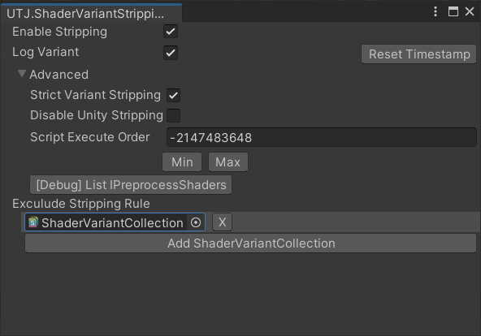

# StrippingByVariantCollection
[日本語はコチラ](README.ja.md)

Find the ShaderVariantCollection in the project and exclude unregistered variants from the build.
You can change the behaiour in the settings window (  "UTJ/ShaderVariantStrip"  ).

## about Setting Window

### Enable Stripping
Set to perform strip processing or not.

### Log Variants
Specify whether to log which variants are included and which are excluded during the build process. Specify whether you want to keep a log of which variants were included and which were excluded. 
It will be written to the directory "ShaderVariants/Builds/Timestamps" under the project. 
This can be done even if Stripping is disabled.

## 「Reset Timestamp」Button
There was a possibility that the log timestamp was not reset properly when building consecutively.  
If you find that the log timestamps are not updated properly during continuous build, please press this button.

### Strict Variant Stripping
When enabled, Shaders that are not in the ShaderVariantCollection will be deleted all Variants.
When disabled, shaders that are not in the ShaderVariantCollection is not performed by any special strip processing.

### Disable Unity Stripping
Enabling this feature will remove the IPreprocessShaders under the "Unity." or "UnityEngine.".( such as Universal RenderPipeline. ) 
If Strict Variant Stripping is not enabled, you cannot use this feature.
*It's implemented by rewriting IL code.

### Script Execute Order
Setting the order of "IPreprocessShaders" in this asset.

### Exclude Stripping Rule
The ShaderVariantCollection asset specified here will be ignored.

 

Reference： 
https://blogs.unity3d.com/jp/2018/05/14/stripping-scriptable-shader-variants/
